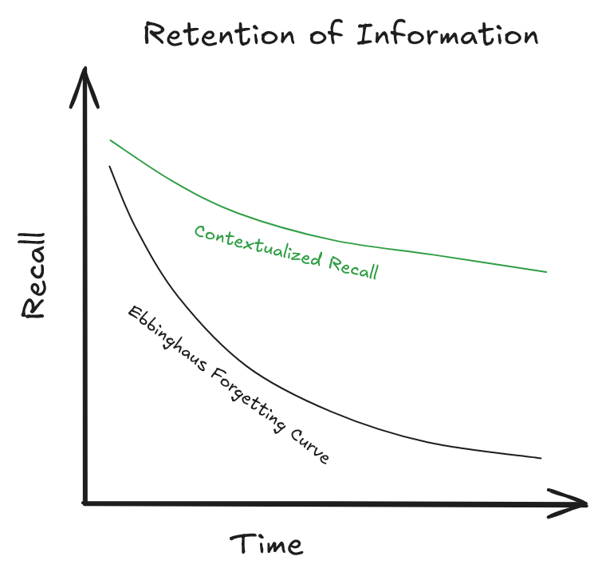

+++
title = 'Contextualize'
date = 2024-11-03T15:02:27Z
draft = false
tags = ["academics", "research", "theories", "learning"]
+++

# Context is king.

The essence of learning anything new comes to *context*. Context is king.
Contextualizing a subject is the way you can relate the subject or information presented to you as a method of learning it deeply.  
  
If you wanted to convert any highly boring and theoretical information into that which is easier for you to understand and process, and retain it over a long period of time, then the idea is to put it into different contexts.  

This results in a higher yield where I quantify yield:
{.poetry}
1. Quality of connections in the brain
2. Quantity of connections in the brain
3. Retention of information
4. Application of information under various contexts


|:--:|
Quality of connections as a metric

In the above picture, I mean to showcase that the higher and deeper quality of questioning you ask to the information, the better you can learn that information.
I mean to discuss how higher quality reasoning results in better retention of the information. It's fundamentally tied to a process known as **Deep Processing.**

Its the inhernet cognitive ability to comprehend any information presented from a higher order rather than lower order level of thinking. Let me explain.
The principle is that, if instead of looking at a piece of information and going - *"I don't understand what they are saying, let me read it again."* or "*I don't understand
what they are saying, let me just memorize it."*

You instead practice deep processing which are as follows:
{.poetry}
1. What are the first principles of the information provided (you need not understand this)
2. How is this information relevant to my current context?
    - The problem I am trying to solve
    - The theory I am trying to understand
    - The idea I am trying to formulate
    - The analysis I am trying to evaluate
3. Can I apply this information to a different scenario or can I encounter this information being used in different ways
in the same scenraio.
    - This could be using a math formula to sovle 4 different classifications of the same nature of problems (applying the basic integral patterns by inducing it i.e. multiplying and dividing by some component to force the pattern to occur).
    - Or, it could be applying a physics concept to 4 different concepts altogether (applying conservation of energy in momentum problems).

If you are unable to relate, the **induce**. Create a hypothetical scenario where this information could become useful in the future.
This technique is really effective at captivating your underlying cognitive processes to make the information more **relevant** and **contextualized**.


|:--:|
Quantity of connections as a metric.

So the image basically describes that the number of connections you make is really equivalently dependent on the quality of questions you're asking. Lower quality questions don't yield more information, but the highest quality of questioning yields a very high number of connections.

It's fairly simplistic, you learn more from asking deeper questions!



