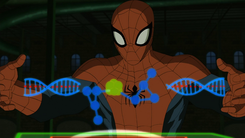
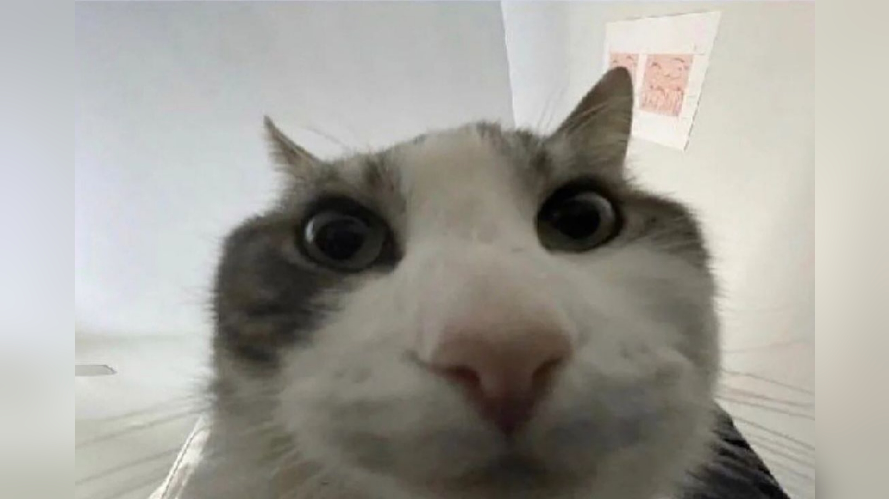
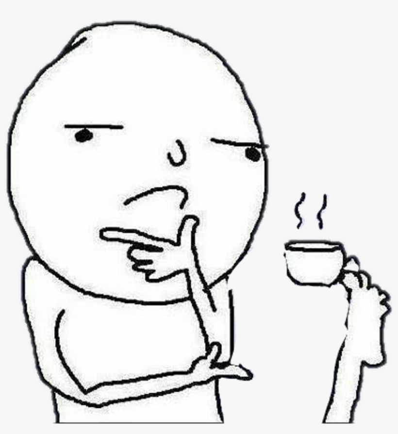
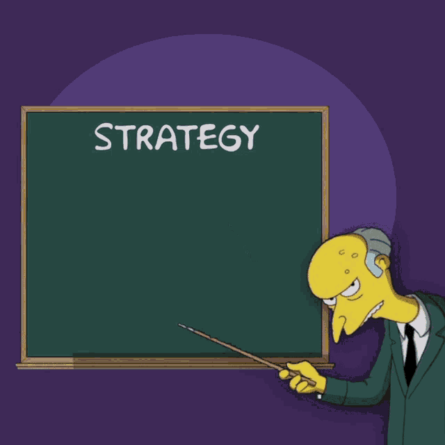

+++
title = 'Distraction'
date = 2024-09-24T22:02:19+05:30
draft = false
tags = ['Life', 'Productivity', 'Work', 'Meaning', 'Education']
+++

# Distractions.

Cut the distractions, or so I yearn to do, and yet I fail miserably, only to get  distracted by something else and well, repeat this again.

I just finished my Cryptography test, absolutely nailed it, no regrets whatsoever. Finished the exam in half the time required. To be fair though, the questions weren't inherently difficult to begin with, and I was in reality just solving based on pure muscle memory. 

Anyways, onto the topic at hand, *distractions*.
See what I did there? I got distracted as I was writing this.

I don't know why, but I am not able to focus for tomorrow's test - *Software Project Management*. On the surface it doesn't seem to be that challenging but I don't want to keep my hopes up high, it could end up being incredibly difficult as the questions are quite open ended.

I am not sure what to do with this subject, I am probably going to get cooked not going to lie.

It's incredible to me how the human brain just actively refuses to store information no matter how hard or relevant the information may be, probably an evolutionary mechanism to prevent storing unnecessary information. 

My mind kept wandering, and it was quite the annoyance. Here I am, in two minds, study and adapt to tomorrow's circumstances or get distracted and flunk and my brain is choosing the latter.

Evolution really did us dirty. Atleast for me, in this specific situation and many such occasions which will inevitably arise in the future.

I should figure something out...

What is the best way to streamline your thoughts into action, and towards the goal of the examination?

*Bear with me for a second, I am thinking out loud*.

Well yesterday, it was the *apparent* scariness of the information that I was studying, and that kinda lit a fire up my ass. 

Not this time though, this strategy probably will not work because my brain is looking at the study materials and going - *"Eh, seems easy enough. I should really start watching the next episode of Link Click."* or *"This weekend right after my tests are over is gonna be inanse, I wonder what I should be doing?"*

I am not sure if this is a good strategy to follow.

Alright, I gotta go figure something out or I am actually cooked. Peace.